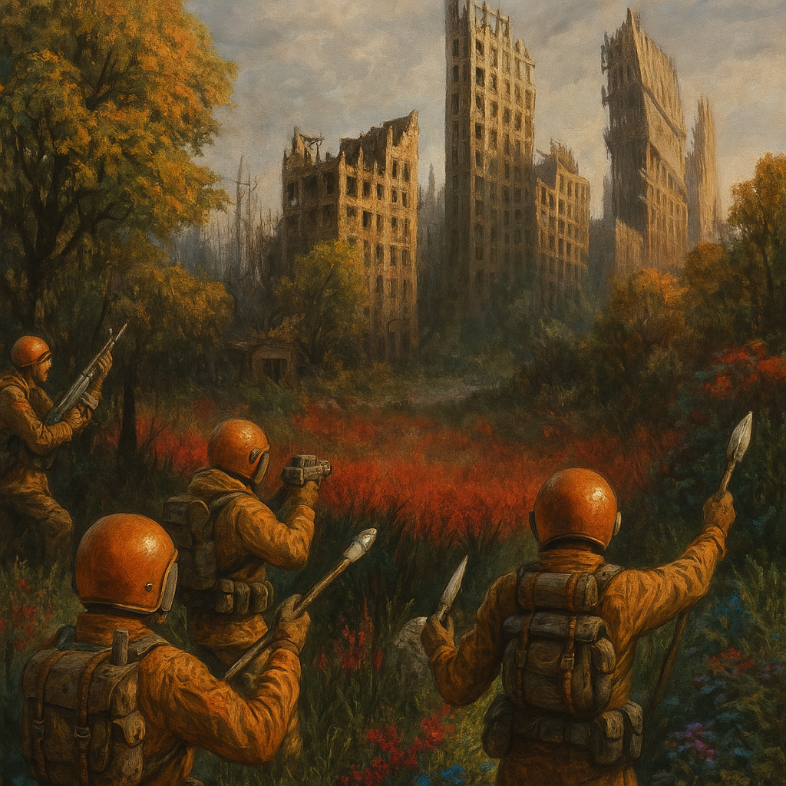

# Gamma World Character Generator



[](https://opensource.org/licenses/MIT)

## Overview

This project is a web application built with Python and FastAPI to generate characters for the 1st Edition Gamma World role-playing game. It implements the core rules for attribute generation, HP calculation, and mutation determination (both random and player-choice methods). Key features include a character generator UI, a browser for saved characters and creatures, and integration with Google Gemini AI to automatically generate character descriptions and images.

## Installation

Follow these steps to set up the project locally:

1.  **Prerequisites**:
    *   Python 3.12 or higher.
    *   `uv`: This project is managed with `uv` (do not use `pip`, `venv`, poetry, or conda). Install it by following the official instructions: [uv Installation Guide](https://docs.astral.sh/uv/getting-started/installation/)
        *   *Windows PowerShell Example*: `powershell -ExecutionPolicy ByPass -c "irm https://astral.sh/uv/install.ps1 | iex"`

2.  **Clone the Repository**:
    ```bash
    git clone <repository-url> # Replace <repository-url> with the actual URL
    cd Gamma-World # Or your repository directory name
    ```

3.  **Install Dependencies**:
    *   `uv` manages dependencies for you. Run `uv sync` once (or just run the app; `uv run` will also ensure deps are present).

4.  **Environment Variables**:
    *   Create a file named `.env` in the project's root directory.
    *   Add your Google AI Studio API key to the `.env` file:
        ```dotenv
        GOOGLE_API_KEY=YOUR_API_KEY_HERE
        ```
    *   Replace `YOUR_API_KEY_HERE` with your actual key. The AI features for description and image generation will not work without a valid key.

## Usage

To start the application server:

```bash
uv run main.py
```

This command uses `uv` to set up a virtual environment (if needed), install dependencies from `pyproject.toml`, and run the FastAPI application using Uvicorn.

Once the server is running, access the application in your web browser at: `http://localhost:8000` (or the address provided in the terminal output).

## Documentation

For a detailed breakdown of the project structure, modules, classes, functions, and comprehensive API endpoint descriptions, please refer to the [DOCUMENTATION.md](DOCUMENTATION.md) file.

## API Reference (Summary)

Here are some of the key API endpoints provided by the application:

| Method | Path                               | Summary                                                              |
| :----- | :--------------------------------- | :------------------------------------------------------------------- |
| GET    | `/`                                | Serves the main menu page.                                           |
| GET    | `/generator`                       | Serves the character generator UI page.                              |
| GET    | `/browser`                         | Serves the character browser page, listing saved characters.         |
| GET    | `/browser/{char_id}`               | Displays the details of a specific saved character.                  |
| GET    | `/creature_browser`                | Serves the creature browser page, listing loaded creatures.          |
| GET    | `/creature_browser/{creature_slug}`| Displays the details of a specific creature.                         |
| POST   | `/generate_character`              | Starts the character generation process.                             |
| POST   | `/save_character`                  | Saves a completed character's JSON data and optional image to disk.  |
| DELETE | `/characters/{character_id}`       | Deletes a character's data (JSON, image).                            |
| POST   | `/generate_description`            | Generates an AI textual description for the character.               |
| POST   | `/generate_image`                  | Generates an AI image based on the character's description.          |

*(See [DOCUMENTATION.md](DOCUMENTATION.md) for full details)*

## Authors

Contributors names and contact info

* David Jackson
* [GitHub](https://github.com/j-loquat)

## Contributing

Contributions are welcome!

*   **Issues**: Please report bugs or suggest features by opening an issue on the GitHub repository.
*   **Pull Requests**: If you'd like to contribute code, please fork the repository and submit a pull request.
*   **Code Style**: Please try to maintain consistency with the existing code style (e.g., formatting, naming conventions).
*   **Lint/Format**: `uv run ruff check .` and `uv run ruff format .`
*   **Testing**: (No automated tests are currently set up). Please manually test your changes thoroughly before submitting a pull request.

## License

This project is licensed under the CC0 License. Feel free to use, modify, and distribute the code.

## Acknowledgments

Inspiration from the original Gamma World RPG 1e rules:
* [Gamma World Wiki](https://gammaworld.fandom.com/wiki/Gamma_World_First_Edition)
* [Gamma World Wikipedia](https://en.wikipedia.org/wiki/Gamma_World)
